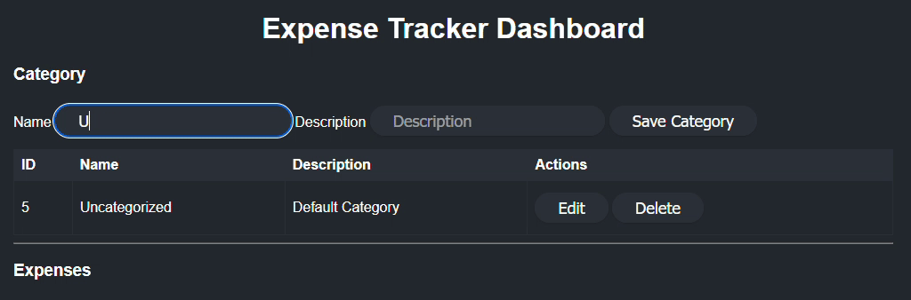
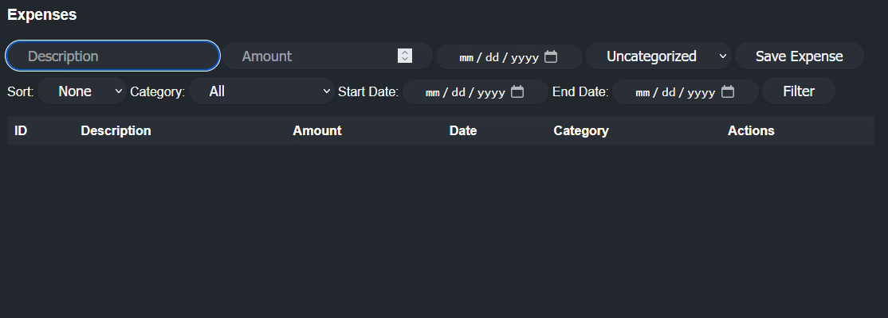

# Task Manager Web Application
## [日本語説明書](media/README_ja.md)

Task Manager web application that allow user to register/login and managing tasks.

### Feature
- Create, read, update, and delete expense records
- Categorize expenses with custom category
- Sort expenses by date range and category
- Sort expenses by date (ascending or descending)
- Single page UI

## Installation and running
```bash
git clone https://github.com/Larry-Tomson/expense-tracker-public
cd expense-tracker-public
```
Build
```bash 
mvn clean install
```

Run
```bash
mvn spring-boot:run
```
Application endpoint Default port : [localhost:8069](http://localhost:8069)
Edit web application and SQL database endpoint [here](src\main\resources\application.properties)

## Requirement
- **Java Development Kit (JDK) 11 or later**  
  The project requires JDK 11 or above.  
  - [Download OpenJDK](https://jdk.java.net/)
  - [Oracle JDK](https://www.oracle.com/java/technologies/javase-jdk11-downloads.html).

- **Apache Maven 3.6.0 or later**  
  Maven is used to manage the project build lifecycle and dependencies.  
  [Maven Installation Guide](https://maven.apache.org/install.html)

- **MySQL**

## Stack
- Backend: Spring Boot, Spring JPA
- Database: mySQL
- Frontend: Html/css, javascript

## DEMO
### category create, update and delete

### expense create, update and delete


